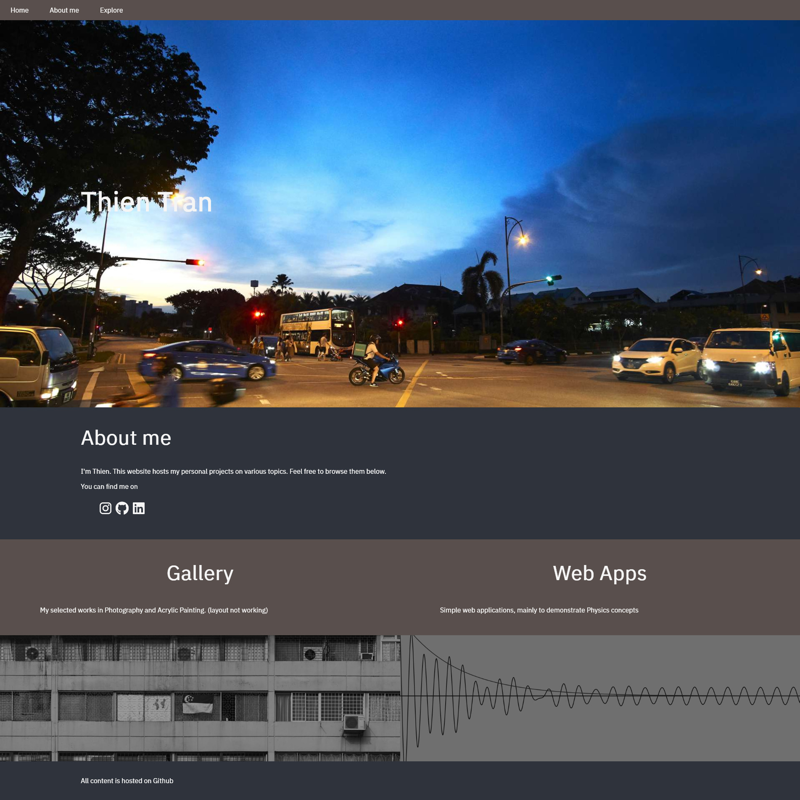

gau-nernst.github.io (https://gau-nernst.github.io/)
==========================

# Description

This is my personal website, mainly to practice concepts I have learned in front-end web development. It will show navigation to my other web projects.

I am proud that this is a completely static website. Meaning, there is __no__ Javascript involved!

## Layout

(The above screenshot is not up to date. I am lazy to update it.)

I am trying to make the layout work for both mobile devices and desktops. You know, getting responsive design to follow the trend. It is kinda hard so far. One thing I realize is that: __USE FLEXBOX FOR EVERYTHING__ haha.

## Projects

As listed in the [website](https://gau-nernst.github.io/), there are two projects going on:
- __Gallery__: show my artistic works
- __Web apps__: Javascript applications

I spend most of my time on the web apps, although the progress is still very slow. Gallery is not working at all, and I have to plan to work on it.

There is a third project I'm trying to work on. It aims to explain some interesting math concepts. This is not on the website yet, so I will just write it here.

I wrote some math explanation, but haven't really planned out the structure for this project yet. Maybe once I finish fixing responsive design on this main page and the web apps, I will dedicate some time to this math project.

_Last updated on 28 July 2019_